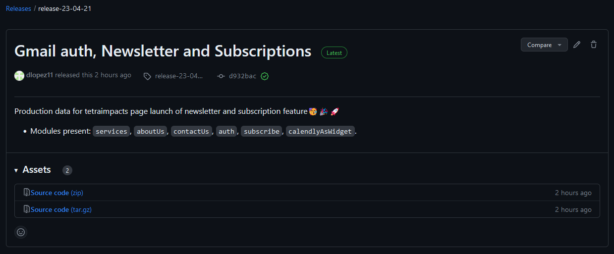

This is a [Next.js](https://nextjs.org/) project bootstrapped with [`tetraimpacts-nextjs-template`](https://github.com/tetraimpacts/tetraimpacts-nextjs-template) template.

## Getting Started

First, run the development server:

```bash
npm run gen:microcopy
npm run dev
# or
yarn gen:microcopy
yarn dev
```

# Tetraimpacts-Web App

## Coding Style

The library uses [Airbnb JavaScript Style Guide](https://airbnb.io/javascript/react/) , and enforces it using `eslint`, utility `prettier` libs, and git pre-commit hook(with `husky` and `lint-staged`). The lib `npm-run-all` is also used for a parallel execution of required code validations.

## Env variables

- TI web app config:

  - `DEPLOY_TYPE`: If equals `production`, the app will treat the deploy as a production one. Currently not in use.

  - `NEXT_PUBLIC_HOST`: Url to use in share and alike functionalities that does not resolve current app url in its usage.

  - `NEXT_PUBLIC_ENABLED_MODULES`: A comma separated list of active modules (`services`, `aboutUs`, `contactUs`,`blogs`, `auth`, `subscribe`,`calendlyAsWidget`,`facebookAuth`,`emailAuth`, `careers`).
  - `NEXT_PUBLIC_DEBUG_I18NEXT`: Set to `true` to debug usage of i18n.
  - `NEXT_PUBLIC_DISABLE_BLOGS_METRICS_HYDRATION`: Set to `true` to disable hydration of blogs metrics in `api/cachedBlogs`.
  - `NEXT_PUBLIC_DISABLE_BLOGS_METRICS_HYDRATION_ON_BUILD`: Set to `true` to disable hydration of blogs metrics at build time.

- Contentful:

  - `CONTENTFUL_SPACE_ID`
  - `CONTENTFUL_SPACE_ENV_ID`
  - `CONTENTFUL_ACCESS_TOKEN`
  - `CONTENTFUL_PREVIEW_ACCESS_TOKEN`
  - `CONTENTFUL_MANAGEMENT_TOKEN`
  - `NEXT_PUBLIC_CONTENTFUL_SPACE_ID`
  - `NEXT_PUBLIC_CONTENTFUL_SPACE_ENV_ID`
  - `NEXT_PUBLIC_CONTENTFUL_ACCESS_TOKEN`

- Firebase

  - `NEXT_PUBLIC_FIREBASE_PUBLIC_API_KEY`
  - `NEXT_PUBLIC_FIREBASE_AUTH_DOMAIN`
  - `NEXT_PUBLIC_FIREBASE_PROJECT_ID`
  - `NEXT_PUBLIC_FIREBASE_STORAGE_BUCKET`
  - `NEXT_PUBLIC_FIREBASE_MESSAGING_SENDER_ID`
  - `NEXT_PUBLIC_FIREBASE_APP_ID`
  - `NEXT_PUBLIC_FIREBASE_MEASUREMENT_ID`

- Email
  - `EMAIL_SERVICE_PORT`
  - `EMAIL_SERVICE_SECURE`
  - `SENDER_EMAIL`
  - `RECEIVER_EMAIL`
  - `RECEIVER_EMAIL_CC`
  - `EMAIL_SERVICE_USER`
  - `EMAIL_SERVICE_PASSWORD`

### Managing env variables in vercel

- Install vercel cli `npm install --global vercel@latest`. 
- Retrieve env variables `vercel pull --environment=<production | preview | development>`.
  - For the preview of pre-production branch use `vercel pull --yes --environment=preview --git-branch=pre-production`. (The `--yes` is to bypass confirmation of overwrite)

## Yarn Scripts

The following utility Yarn scripts are available:

- `format:check`: Gets a list of all unformatted code in the project.
- `format:fix`: Fixes the format issues of all the unformatted files.
- `prettier`: Runs `prettier` and below functionality can be added with `--arg`.
- `lint`: Runs configured linter.
- `type:check`: Checks the code for type issues.
- `validate`: Runs all three: linting, formatting, and type checking, in parallel.
- `test`: Runs all `react-scripts` tests(use jest deep down).
- `test-watch`: Runs all tests in watch mode.
- `gen:microcopy`: Generates translation files from Contentful data. (Needs access to `NEXT_PUBLIC_CONTENTFUL_SPACE_ID` and `NEXT_PUBLIC_CONTENTFUL_SPACE_ENV_ID` env variables)
- `prebuild`: Runs `gen:microcopy` automatically before building app.## Development
## I18n
To use i18n in the app, particularly in server side, we use [next-i18next](https://github.com/i18next/next-i18next), so any page that uses i18n and server side data fetching technics should be in the likes of:
``` tsx
import {serverSideTranslations} from 'next-i18next/serverSideTranslations';
import {defaultLanguage} from 'config/language';

export default function Home() {

  return (
    <>
    </>
  );
}


export const getStaticProps = async ({locale}) => {
  
  return {
    props: {
      ...(await serverSideTranslations(locale || defaultLanguage, ['common'])),
    },
  };
};

```
And to use it:
``` tsx
import {useTranslation} from 'next-i18next';

export default function BaseLayout({children}: {children: ReactNode}) {
  const {t} = useTranslation();

  return (
    <>
      <Head>
        <title>Tetraimpacts</title>
        <meta name="description" content={t('app-meta-description') || ''} />
        <link rel="icon" href="/favicon.svg" />
      </Head>
    </>
  )
};
```
:warning: Use the `useTranslation` hook from `next-i18next`, importing it from `react-18next` causes hydration errors.

## Notes

- As `lint` script `eslint` is in use instead of `next lint` because of compatibility issue of the latest with `lint-staged`.
- :warning: The `.prettierignore` file should contain also the data from `.gitignore` and `.eslintignore`, and right now there is no clean way of doing it dynamically (would be cool though). So any changes in the above files should be mirrored in ` .prettierignore`.
- :warning: The `dotenv` dependency is only used to be able to access `NEXT_PUBLIC_CONTENTFUL_SPACE_ID` and `NEXT_PUBLIC_CONTENTFUL_SPACE_ENV_ID` env variables during `gen:microcopy` script.

## Pages query params supported

- `blogs`: 
  - `page`: Page number.
  - `limit`: Limit of blogs to show per page.
  - `order`: How to order blogs, should be a value included in `OrderBy` enum
  - `title`: Title to filter blogs by. Results will be blogs containing that string in it's title.


# Contentful models and flow
## Tags
Due to some restrictions using contentful, for a correct internationalization of the app (including tags), we are using the microcopy model to provide translations to tags (contentful native tags implementation). The map between the two is id(tag) to key(microcopy), meaning the text field of the tags is not used for anything rigth now, and also meaning that the id of tags should meet the key field restrictions of the Microcopy model, as explained below.
The key field values in the Microcopy model must match the following regex pattern: `^[a-z][a-zA-Z0-9]+(?:[-_][a-zA-Z0-9]+)*[a-zA-Z0-9]{0,30}$`

Which means they:
1. Must start by any lowercase letter

2. Must be followed by a letter (any case) or number

3. Must have minimum length 2

4. Must have maximum length 32

5. Can use every alphanumeric character from the 3rd position

6. Can use underscore or hyphen (from the 3rd and up to the 31th position, meaning it cannot end with those characters).

## Blogs metrics hydration
The data related to likes and views of a particular blog post is stored and updated real-time in firestore database, but in order to have strong filtering and sorting capabilities directly from contentful in `blogs` page, the model of blogs are hydrated periodically with data from firestore. This is done via `api/contentful/updateBlogsMetrics` API endpoint.

## Hooks

# API Endpoints

### Update Blogs Metrics [ LEGACY ] ⚠️
This endpoint is used to update the metrics of blogs in contentful, it is used to hydrate the data from firestore to contentful, and it is triggered periodically by a cron job in github.
Url: `api/contentful/updateBlogsMetrics`
Auth: `tiwaauthtoken` header
Body: 
```
{
  "spaceId": "<contentfulSpaceId>",
  "environmentId": "<contentfulEnvironmentId>"
}
```
### Cached Blogs
This endpoint is used to index, filter and sort blog posts more efficiently. The idea is to store a list of all available blog post at build time, containing the minimal information required, and to return from this endpoint an hydrated list with views and likes from firestore. This also uses cache of vercel serverless functions, ideally revalidating the cache daily.
Url: `/api/cachedBlogs`
Query Params: 
```
{
  "locale": "en-US | es-419",
}
```

# Deploy to production
The pre-production branch should be used as a testing env of what goes into production, using most of the configurations if not all, of the production env.

When everything is ready to make a release to production, first run continuous backup action in [CMRv2](https://github.com/tetraimpacts/CMRv2) repo and make a release (View CMRv2 repo doc).

When production branch of contentful is ready, and env variables for production in vercel are up to date, make a PR from `pre-production` to `main`, after its approval, successful merge and correct build in vercel, make a release with detailed information of new features or changes, and tag it accordingly to corresponding tag of CMRv2 release tag. Example of release:

In this repo:


In CMRv2:


The description and title in the releases does not need to be equals, but it helps.
Finally is a good practice to have tags including some versioning of app, so additionally add a tag following [semantic versioning](https://semver.org/), like in this case `v1.1.0`.

# Firebase and backend
[Firebase doc and rules](docs/firebase.md)